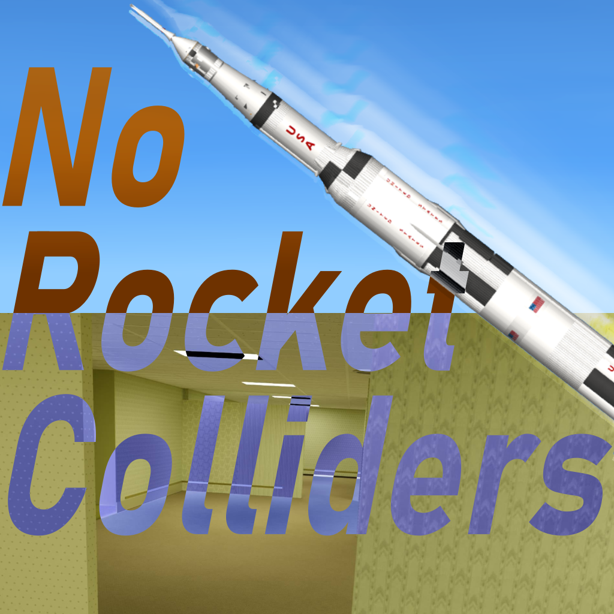

# NoRocketColliders

Credits go to IceFoxy for the logo!

A code mod for the video game Spaceflight Simulator (SFS) that disables colliders between rockets and other rockets.

Keybind to enable/disable colliders: Keypad Multiply (asterisk, \*)

This default keybind can be changed in the settings menu, either in the World or Build scene.

## Requirements and Dependencies

- SFS (PC Version)
  - v1.6.00.16 and newer
- [BetterKeybinds](https://github.com/kojamori/BetterKeybinds)
  - v1.1.0 and newer

## Installation

[Code Mod Installation Guide | SFS Modding Guide](https://kojamori.github.io/SFS-Modding-Guide/getting-started/installation/code-mods)

## Social Media

### Forum Post

https://sfsforum.com/index.php?threads/norocketcolliders.20111/

### SFS Modding Guide

https://kojamori.github.io/SFS-Modding-Guide/

### Discord Server

[Join the discord server here!](https://discord.gg/QHEmcehAe9)

# License

See the [LICENSE](LICENSE) file for details.
